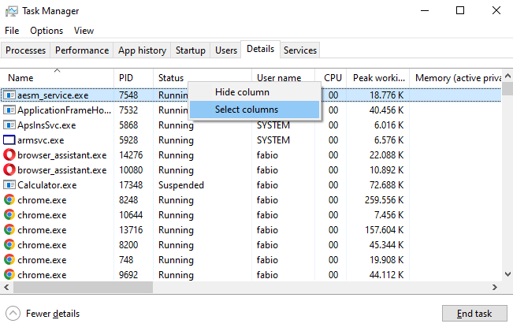
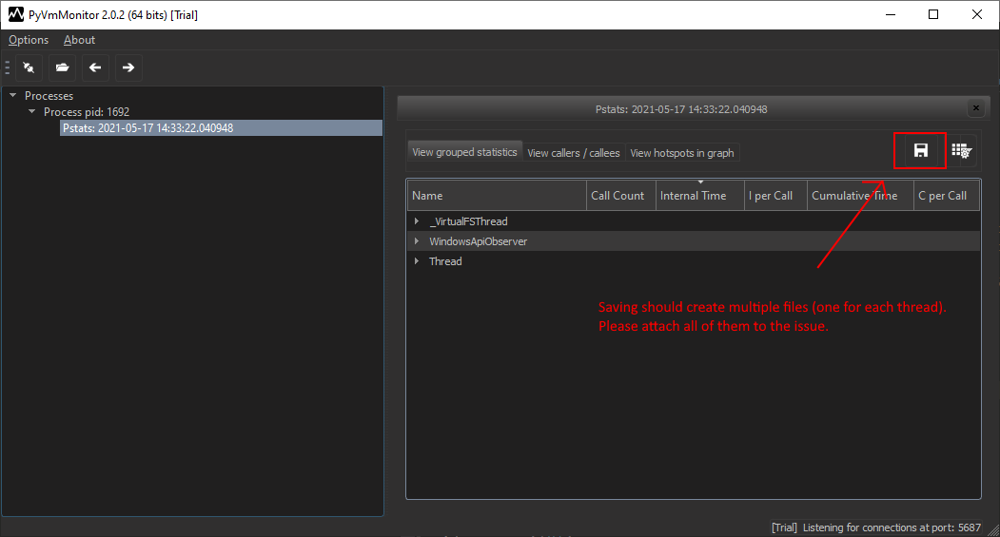

Reporting issues
==================

To report some issue in the `Robot Framework Language Server`, please create a ticket in 
the [Issue Tracker](https://github.com/robocorp/robotframework-lsp/issues/new).

If it's a bug, please collect the logs so that it's possible to verify what's happening.

VSCode logs
--------------

To collect log files in VSCode, it's possible to either:
- Set the `robot.language-server.args` setting to `["-vv", "--log-file=<path/to/robotframework_ls.log>"]` .  
- Set an environment variable: `ROBOTFRAMEWORK_LS_LOG_FILE=<path/to/robotframework_ls.log>`.

Note: It's possible to use `Ctrl+,` to open the user preferences to set some setting.

After it's set, close the client, make sure that `<path/to/>` does not contain any `.log` files and then
open the client again.

Then, reproduce the related issue (which may be as simple as opening a file for code analysis or
doing a code-completion or find definition action), then close the client right afterwards (so that
no other unrelated actions add noise to the log), collect all the `.log` files created
in the specified directory and attach them to the issue.

Note: the language server usually creates multiple log files, one for each process it spawns,
and all of those should be attached.

If you have any non-empty files in:

```
C:\Users\<username>\.robotframework-ls\*.log
C:\Users\<username>\*_critical.log
```

Also attach them to the created issue.
   
**Important** : After the logs are collected, **remove** (or comment) the `robot.language-server.args` setting 
or unset the `ROBOTFRAMEWORK_LS_LOG_FILE` environment variable to **stop the logging** 
(having the logging on makes the language server considerably slower). 

Intellij logs
----------------

0. Updating getting the logs from the language server.

To do that it's possible to either:
- Set the `Language Server Args` in the Intellij settings to `["-vv", "--log-file=<path/to/robotframework_ls.log>"]` .  
- Set an environment variable: `ROBOTFRAMEWORK_LS_LOG_FILE=<path/to/robotframework_ls.log>`.

1. In the menu: `Help | Diagnostic Tools | Debug Log Settings`

Add the following entries:
```
#robotframework.intellij
#robotframework.lsp.intellij
```

2. Activate the menu: `Help | Show Log in Explorer`

3. Close Intellij.

4. Remove the existing `idea.logXXX` logs from the folder that was opened in `Help | Show Log in Explorer` (the folder is something as `C:\Users\<username>\AppData\Local\JetBrains\<PyCharm version>\log`).

5. Remove the files from `C:\Users\<username>\.robotframework-ls`

6. Reopen Intellij, reproduce the error and close Intellij.

7. Attach the following log files to the created issue:
- Log files in the `<path/to/robotframework_ls.*.log>` which was specified (multiple log files should be created for a single run in that directory).
- `idea.logXXX` files from  `C:\Users\<username>\AppData\Local\JetBrains\<PyCharm version>\log`
- `C:\Users\<username>\.robotframework-ls\*.log` 
- `C:\Users\<username>\*_critical.log` 

**Important** : After the logs are collected, **remove** (or comment) the `Language Server Args` setting 
or unset the `ROBOTFRAMEWORK_LS_LOG_FILE` environment variable to **stop the logging** 
(having the logging on makes the language server considerably slower). 


Report performance issues
---------------------------

If somehow the language server is consuming too much CPU or something is taking
too long for some action, profile information should be provided in the issue
report to be able to track down the issue.

To do that:

1. Download and install [PyVmMonitor](https://www.pyvmmonitor.com/download.html) -- you can use the 15 day trial.

2. Attach it to the process which has the high CPU usage (it can do it on the fly so you shouldn't need
any special setup). Please follow the steps from: [https://www.pyvmmonitor.com/attach_to.html](https://www.pyvmmonitor.com/attach_to.html). 

Note: in Windows you can right-click the tabs in the `Task Manager` and select `PID` and `CPU` to find out which `PID` should be profiled.

<kbd></kbd>

3. Save the pstats and attach them to this issue.




